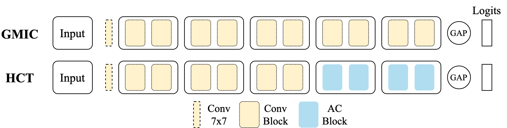
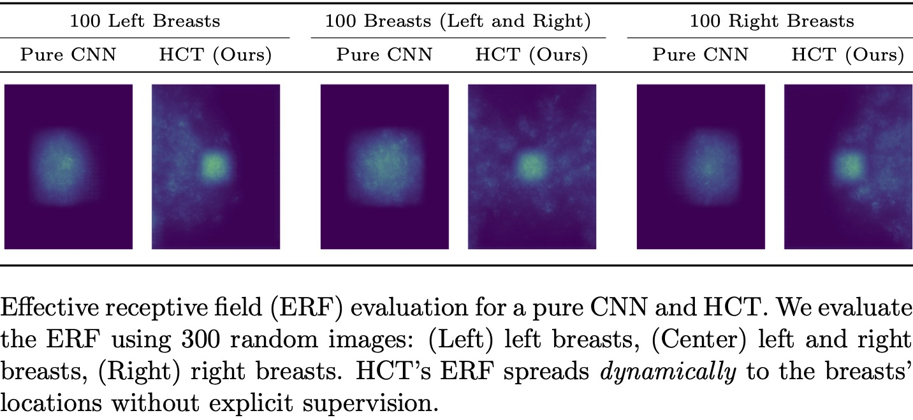

# High-resolution Convolutional Transformer (HCT)

The official implementation of `Deep is a Luxury We Don't Have` accepted by MICCAI 2022.

To model long-range dependencies in high-resolution images, HCT leverages Performers. Performers are self-attention layers with linear complexity. These efficient self-attention layers are deployed at the late stages of HCT, while early stages leverage vanilla convolutional layers as shown in the next figure. AC denotes Attention-convolution blocks. Please checkout our paper for more details.

Through self-attention, HCT models long-range spatial dependencies in high-resolution image while remaining relative shallow (22 layers). The next figure shows HCT's effective-receptive-field (ERF) compared to pure CNN. HCT's ERF is less concentrated around the center and spreads _dynamically_ to the breasts' locations without explicit supervision.

## Requirements

- Python 3+ [Tested on 3.6]
- PyTorch 1.X [Tested on torch 1.9.0 and torchvision 0.10.0]

## Usage example

- Checkout the `main` function inside `hct_base.py`

### MISC Notes

- HCT leverages the vanilla convolutional stages from [GMIC](https://github.com/nyukat/GMIC/blob/master/src/modeling/modules.py).
- HCT leverages the Performer implementation provided by [lucidrains](https://github.com/lucidrains/performer-pytorch/blob/main/performer_pytorch/performer_pytorch.py).

### Citation

Coming Soon.
